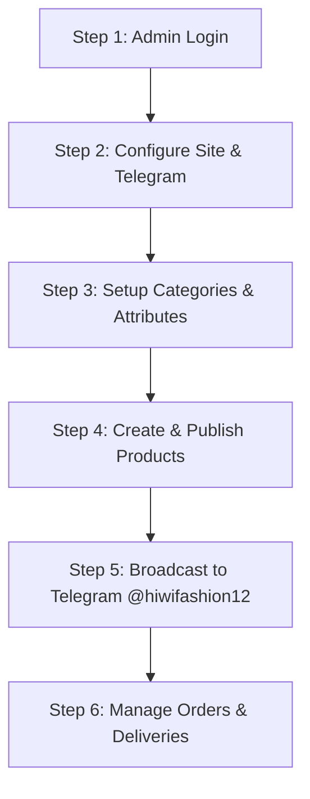

# 📖 Hiwi Fashion Atelier — Admin User Manual

Welcome to the **Hiwi Fashion Admin Portal**. This guide provides a step-by-step walkthrough for administrators to manage products, categories, Telegram auto-broadcasting, customer orders, and site settings efficiently.

---

## 🚀 Step 1: Access & Authentication

1. **Navigate to Admin Login**:
   - Open your browser and go to `https://your-domain.com/admin/login` (or `/admin`).
2. **Sign In**:
   - Enter your registered **Admin Email** and **Password**.
   - Click **Sign In to Dashboard**.
   - *Note: Only verified administrators can access this portal.*

---

## ⚙️ Step 2: System Configuration & Telegram Setup

Before posting products, configure your store identity and Telegram bot settings.

1. Go to **Site Settings** (`/admin/site` or click **Site Config** in the sidebar).
2. **Store Contact & Branding**:
   - **Store Name**: Set your brand name (e.g., `Hiwi Fashion`).
   - **Tagline**: Set your subtitle (e.g., `Habesha & Modern Atelier`).
   - **Contact Phone**: Enter your store phone number (e.g., `+251 911 234 567`). *This phone number automatically appears in Telegram posts and product detail pages.*
3. **Telegram Bot & Group Configuration**:
   - **Bot Token**: Paste your Telegram Bot Token (e.g., `8754528608:AAGbDG_ilyMr_iNUxXfi...`).
   - **Telegram Group/Channel**: Enter your group link or handle (e.g., `@hiwifashion12` or `https://t.me/hiwifashion12`).
   - **Make Bot Admin**: Ensure your bot is added as an **Administrator** in your Telegram group with "Post Messages" permission.
4. **Test Connection**:
   - Click **Test Telegram Connection**. You will receive an instant test message in `@hiwifashion12` confirming successful integration.
5. Click **Save Settings**.

---

## 🗂️ Step 3: Managing Categories & Attributes

Organize your catalog structure before adding products.

1. **Categories (`/admin/categories`)**:
   - Add main categories (e.g., *Habesha Kemis*, *Suit & Blazer*, *Casual*, *Jewelry*).
   - Set thumbnail images and display order.
2. **Subcategories (`/admin/subcategories`)**:
   - Add child categories linked to parent categories (e.g., *Bridal Kemis*, *Men's Blazer*).
3. **Product Attributes (`/admin/properties`)**:
   - Define custom filters such as Fabric Type, Colors, Sizes (S, M, L, XL), and Occasions.

---

## 👗 Step 4: Adding & Managing Products

1. Navigate to **Products** (`/admin/products` or click **Products** in the sidebar).
2. **Create New Product**:
   - Click **+ Add New Product** at the top right.
   - **Basic Info**: Enter Product Name, Category, Subcategory, Description, and Fabric/Material.
   - **Pricing**: Enter Price in **ETB** (e.g., `4500`). Optionally set Original Price for sale discount tags.
   - **Stock & Availability**: Set Stock Quantity and mark item as **In Stock**.
   - **Images**: Upload or enter primary cover image and gallery images.
   - **Variants (Sizes & Colors)**: Select available sizes and color swatches.
3. **Save Options**:
   - **Publish Live**: Saves the product directly to the storefront catalog.
   - **Save as Draft**: Saves for later review without publishing immediately.
4. **Inspect Product**:
   - Click the **Eye icon** (👁️) next to any product in the table to open the **Product Inspector Modal**. Review full specifications, real-time stock, and gallery images.

---

## 📢 Step 5: Telegram Auto-Broadcasting

Share new arrivals with your Telegram community instantly.

1. **From Product List**:
   - Locate the product in the Products Table.
   - Click the **Telegram Icon** (🚀 / 💬) on the right action column.
2. **Automatic Post Content**:
   - The bot posts a high-resolution photo with an elegant caption:
     - **Product Title** (UPPERCASE)
     - **Category & Fabric details**
     - **Contact Phone Number** (`📞 Call / Phone: +251 ...`)
     - **Interactive Buttons**:
       - `View & Order Product` (direct website link)
       - `Order via Telegram`
       - `📞 Call Store` (one-tap instant phone call)
3. Confirm the success notification.

---

## 📦 Step 6: Order Management & Processing

1. Navigate to **Orders** (`/admin/orders`).
2. **Review Incoming Orders**:
   - View order details: Customer Name, Phone, Items Purchased, Delivery Address, Total ETB.
3. **Update Order Status**:
   - Change status to **Processing**, **Shipped**, or **Delivered**.
   - Customer is notified of status updates.

---

## 🎨 Step 7: Visual Theme & Hero Banner Customization

1. Go to **Theme & Layout** (`/admin/theme`).
2. **Hero Banner**: Update the main landing page hero photo, headline, and subtitle.
3. **Color Palette**: Customize primary accent colors (e.g., Luxury Gold `#C5A880`, Forest Emerald `#10B981`, Deep Charcoal `#1A1A1A`).

---

## 💡 Quick Reference Workflow Summary

---
*For support or technical queries, contact system administration.*
